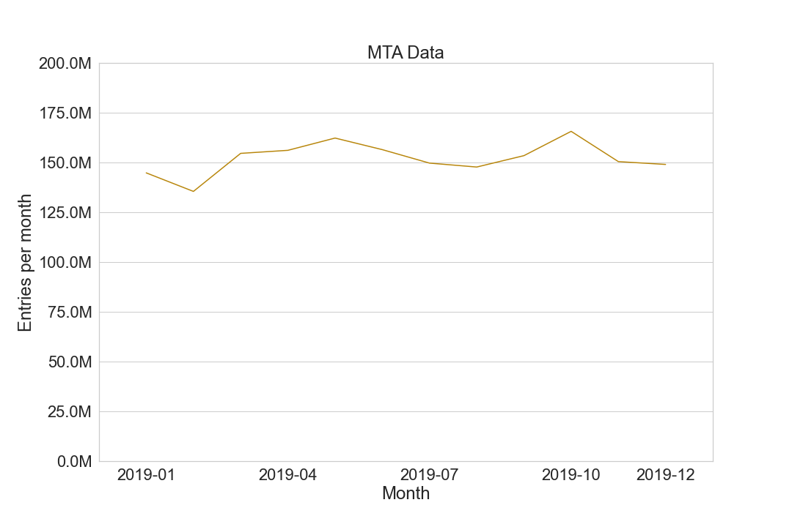

# EDA MVP
## Exploring factors affecting NYC MTA ridership
##### Josh Wang
##### Jan 16 2022

---
### MVP Overview
**Goal**:
The Metropolitan Transportation Authority (MTA) has asked us to investigate when and where they can reduce the number of trains to reduce their budget. I will look at multiple potential factors that affect the MTA ridership.

**Process**:
The primary dataset is the MTA turnstile data of New York City: http://web.mta.info/developers/turnstile.html

Rideshare services data came from the NYC Taxi & Limousine Commission (TLC): https://www1.nyc.gov/site/tlc/about/aggregated-reports.page

COVID data came from https://github.com/nytimes/covid-19-data

**Preliminary visualization**:

Figure 1. Monthly MTA entries of all stations in NYC of 2019

Figure 2. Daily and 7-day rolling average covid cases in NYC

Figure 3. Monthly Uber and Lyft trips dispatched

**Preliminary conclusions**:

1. MTA ridership is higher in Spring and Fall and lower in Summer and Winter of 2019.
2. The upward trends of COVID cases and rideshare service use might affect MTA ridership.
3. It would also be interesting to look at the potential relationship between weather and MTA ridership.
